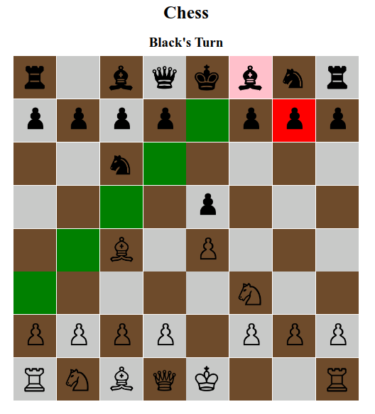

# Chess Game

This is a simple implementation of a chess game using HTML, CSS, and JavaScript.

## Overview

This project aims to provide a functional chess game where users can play against each other or against an AI opponent. It includes all the standard chess rules and movements for each piece.

## Features

- **Piece Movements**: All pieces move according to the standard rules of chess.
- **Game Modes**: Options to play against another player.
- **Responsive Design**: The game interface is designed to work well on different screen sizes.

## Technologies Used

- **HTML**: For the structure and layout of the game.
- **CSS**: For styling and design elements.
- **JavaScript**: For implementing game logic, movements, and interactions.

## How to Play

1. **Clone Repository**: Clone this repository to your local machine.

git clone https://github.com/PubuduAriyawansha/Chess-game.git

2. **Open `index.html`**: Open the `index.html` file in a web browser to start the game.

3. **Game Instructions**: Follow on-screen instructions to play the game. Each piece has its own movement rules as per standard chess.

## Future Improvements

- Enhance the AI for more challenging gameplay.
- Add a feature for tracking game history and moves.

## Contributing

Contributions are welcome! Feel free to fork the repository and submit pull requests for any improvements or bug fixes.

## License

This project is licensed under the [MIT License](LICENSE), allowing for modification and distribution as per the license terms.

## Acknowledgments

- Online Tutorials: Multiple online tutorials and articles contributed immensely to understanding chess algorithms, board representations, and piece movements in-depth.

- Friends and Mentors: Special thanks to friends and mentors who provided feedback, suggestions, and encouragement throughout the development process.

## Contact

For any questions or suggestions, feel free to contact Pubudu Ariyawansha via pubuduariyawansa@gmail.com

